# 🚨 Detection and Response to Linux Persistence and Suspicious Command Execution (Wazuh + Auditd)

---

## 📌 Overview 

Simulation of a Linux compromise involving command execution, persistence mechanisms, suspicious process activity, and live incident response investigation.

- Access: ✔ 
- Execution: ✔  
- Persistence: ✔  
- Evasion: ✔  
- Severity: 🔴 8/10 (High)

---

## 📄 Detailed Incident Report

➡️ Full report: [report.md](./report.md)

---

## 🖥️ Environment

- Attacker: `192.168.18.226`
- Target: `WEB-01`
- SIEM: `Wazuh`
- Monitoring: `auditd`
- Service: `Apache2`
- Operating System: `Ubuntu Linux`

---

## 🎯 Attack Scenario

A simulated attacker achieved remote command execution through a vulnerable web application running under the `www-data` context.

After execution, multiple suspicious commands were executed to simulate post-exploitation behavior, persistence establishment, and attacker activity validation.

Persistence mechanisms included:

- Cron persistence
- SSH authorized_keys persistence
- Systemd service persistence

---

## ⚠️ Initial Access

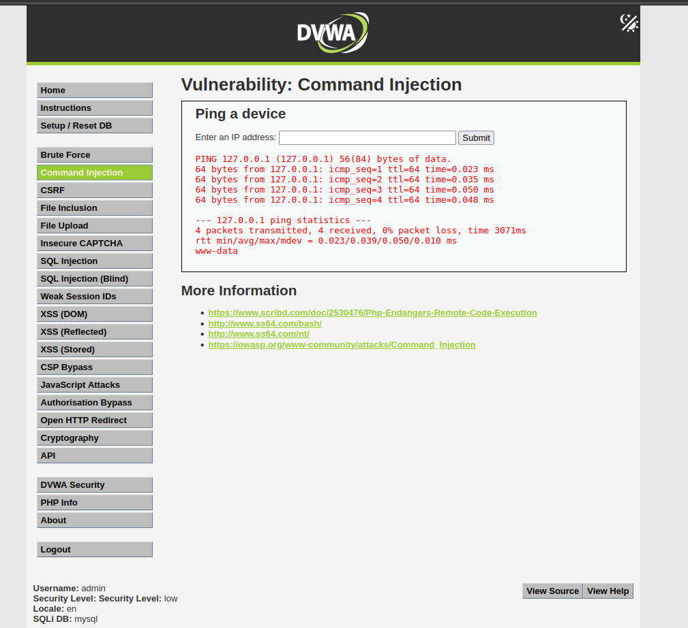

The attacker successfully executed commands via the vulnerable web application context (`www-data`).

---

## 🐚 Reverse Shell Activity

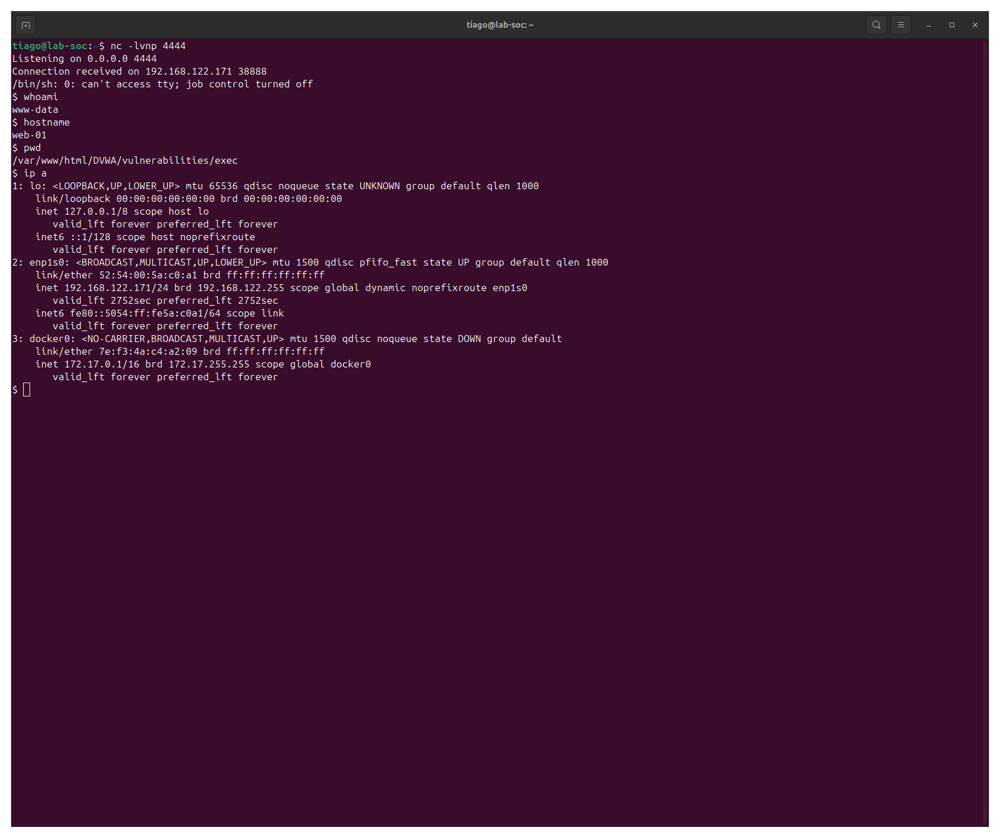

A reverse shell connection was established to simulate attacker interactive access.

---

## 🔎 Initial Enumeration

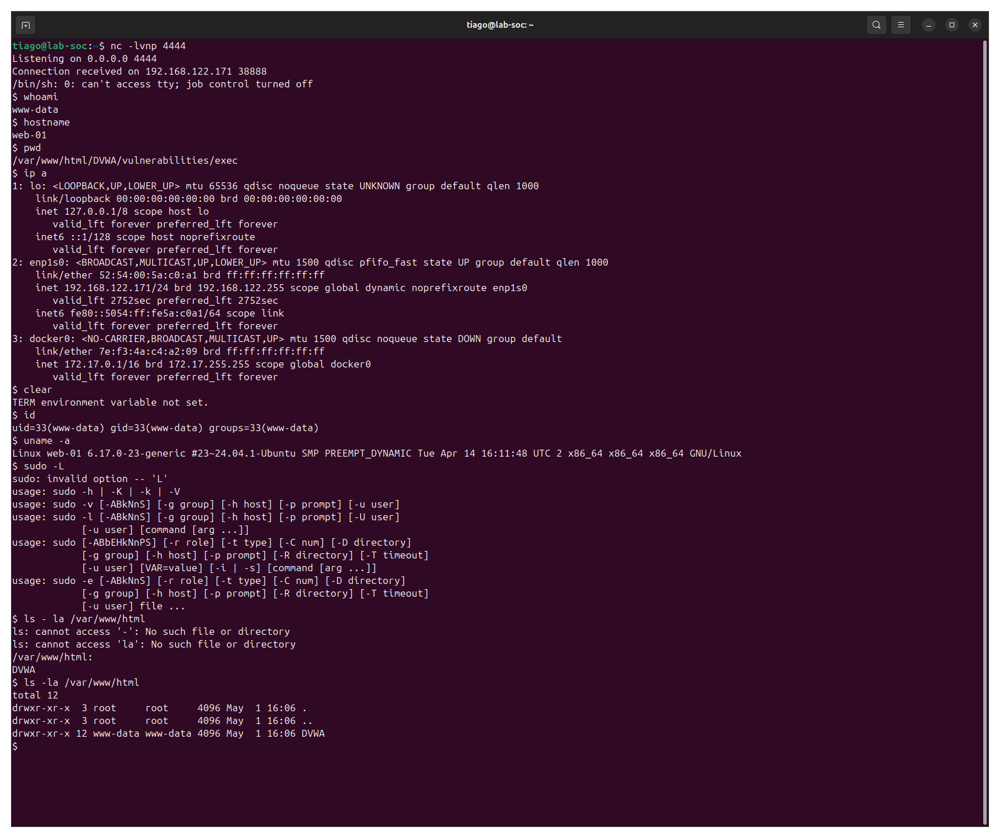

The attacker performed local enumeration to identify privileges, processes, and accessible resources.

---

## 🌐 Network and Process Enumeration

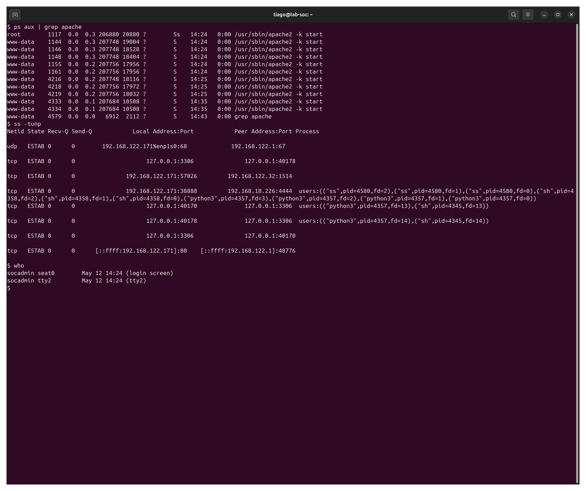

Post-exploitation activity included process inspection and network visibility checks.

---

## 📄 Apache Log Evidence

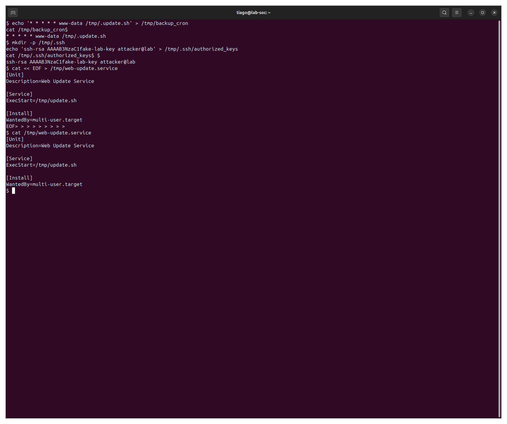

Web application logs recorded suspicious activity associated with command execution attempts.

---

# 🔍 Detection

Detection occurred through:

- `auditd` EXECVE monitoring
- Process inspection
- File artifact analysis
- Persistence hunting
- Manual live response investigation

### Detection Logic

Suspicious command execution involving:

- `curl`
- `wget`
- `chmod`
- `bash`

---

## 🚨 Threat Activity Simulation

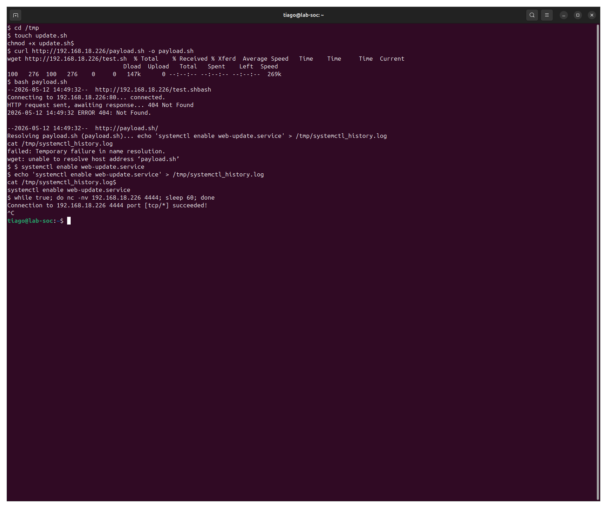

Suspicious commands executed:

- Remote file retrieval
- Bash execution
- Permission modification
- Persistent outbound connection attempts

---

# 🧠 Investigation

## 🔎 Host IoCs Collection

Artifacts identified:

- Malicious cron file
- Fake SSH authorized_keys
- Systemd persistence service
- Suspicious scripts in `/tmp`

---

## 👤 Authentication Investigation

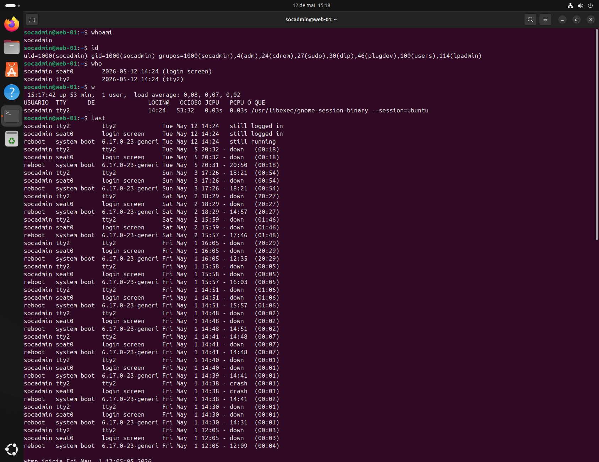

Active sessions and compromised user context were identified during investigation.

---

## 📚 Login History Analysis

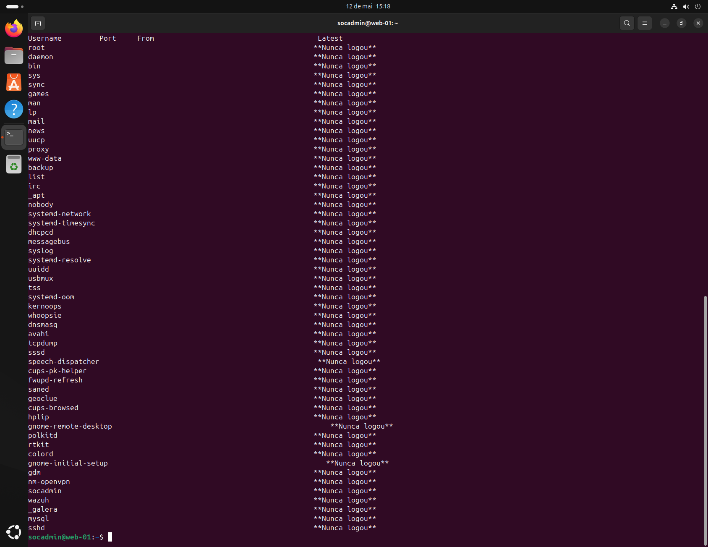

Historical login activity was reviewed using:

- `last`
- `who`
- `w`

---

## 🔐 Persistence IoCs

Persistence mechanisms identified:

- Cron persistence
- SSH key persistence
- Systemd service persistence

---

## ⚙️ Process Investigation

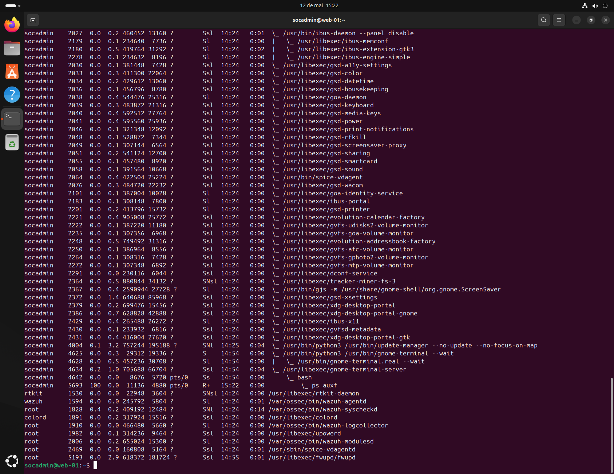

Suspicious processes and active execution chains were analyzed during live response.

---

## 🌳 Process Tree Analysis

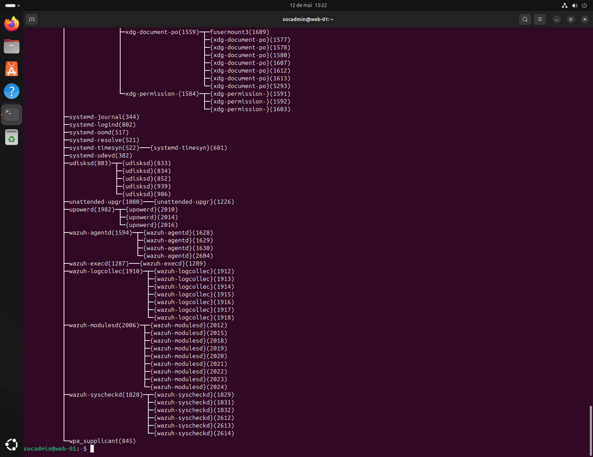

Parent-child process relationships were inspected to understand execution flow and persistence behavior.

---

## 📜 Auditd Command Evidence

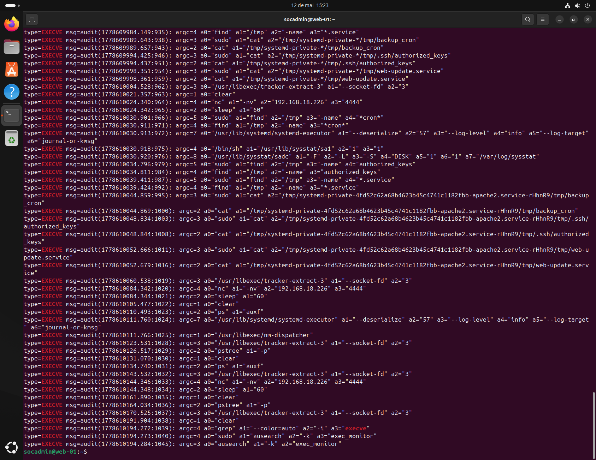

`auditd` successfully captured EXECVE events related to attacker activity.

---

## 🚨 Suspicious Command Detection

Captured suspicious commands:

- `curl`
- `wget`
- `bash`
- `chmod`

---

# 🔎 Indicators of Compromise (IoCs)

| Category | Indicator | Description | MITRE |
|----------|----------|------------|-------|
| Network | `192.168.18.226` | Attacker IP | [T1071](https://attack.mitre.org/techniques/T1071/) |
| Host | `/tmp/update.sh` | Suspicious script | [T1059](https://attack.mitre.org/techniques/T1059/) |
| Host | `backup_cron` | Cron persistence | [T1053.003](https://attack.mitre.org/techniques/T1053/003/) |
| Host | `authorized_keys` | SSH persistence | [T1098.004](https://attack.mitre.org/techniques/T1098/004/) |
| Host | `web-update.service` | Systemd persistence | [T1543.002](https://attack.mitre.org/techniques/T1543/002/) |
| Process | `curl/wget/bash/chmod` | Suspicious execution chain | [T1059](https://attack.mitre.org/techniques/T1059/) |
| Detection | EXECVE events | auditd monitoring | [T1059](https://attack.mitre.org/techniques/T1059/) |

---

# ⚠️ Detection Context

## Wazuh Troubleshooting

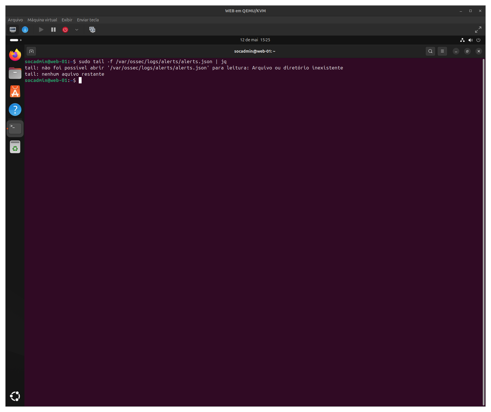

During investigation, the expected Wazuh alert file was not available.

This required manual investigation using:

- `auditd`
- Process analysis
- File system inspection
- Live response techniques

This scenario demonstrates realistic SOC troubleshooting and telemetry validation workflows.

---

# ⚠️ Impact Assessment

- **Access Level:** Remote Command Execution
- **Privilege Level:** `www-data`
- **Scope:** Single Linux host
- **Exposure:** Command execution, persistence creation, suspicious outbound activity

### Severity: 🔴 8/10 (High)

### Justification

- Multiple persistence techniques established
- Interactive shell simulation executed
- Suspicious command execution confirmed
- Host compromise indicators identified
- Outbound communication attempts observed

---

# 🛡️ Response

## Containment

- Suspicious processes identified
- Persistence mechanisms isolated
- Host artifacts documented

---

## Eradication

- Malicious persistence artifacts removed
- Suspicious scripts deleted
- SSH persistence invalidated

---

## Recovery

- System integrity validated
- Persistence mechanisms removed
- Monitoring maintained

---

## 🔐 Hardening

- Enable continuous auditd monitoring
- Improve Wazuh telemetry validation
- Restrict unnecessary shell execution
- Monitor `/tmp` execution activity
- Harden SSH configuration
- Implement persistence detection use cases

---

## ✅ Defense Validation

- Persistence successfully identified
- EXECVE monitoring validated
- Suspicious commands detected
- Investigation workflow completed

---

# 🧬 MITRE ATT&CK

| Technique ID | Technique Name | Description |
|-------------|--------------|------------|
| [T1059](https://attack.mitre.org/techniques/T1059/) | Command and Scripting Interpreter | Bash command execution |
| [T1053.003](https://attack.mitre.org/techniques/T1053/003/) | Cron | Cron persistence |
| [T1098.004](https://attack.mitre.org/techniques/T1098/004/) | SSH Authorized Keys | SSH persistence |
| [T1543.002](https://attack.mitre.org/techniques/T1543/002/) | Systemd Service | Service persistence |
| [T1071](https://attack.mitre.org/techniques/T1071/) | Application Layer Protocol | Outbound connection attempts |

---

# 🎯 Conclusion

Detection → Investigation → Classification → Response

This lab simulated a realistic Linux compromise involving command execution, persistence creation, suspicious process activity, and live forensic investigation.

The investigation validated practical SOC analyst skills involving:

- auditd monitoring
- persistence hunting
- process investigation
- IoC collection
- live response analysis
- MITRE ATT&CK mapping

---

# 🧠 Skills Developed

- Linux incident response
- auditd investigation
- Wazuh troubleshooting
- Persistence hunting
- Process analysis
- IoC collection
- MITRE ATT&CK mapping
- Threat investigation
- Live response workflow

---

# 📞 Contact

LinkedIn: https://www.linkedin.com/in/tiagokrysiaki/  
GitHub: https://github.com/TiagoKrysiaki
