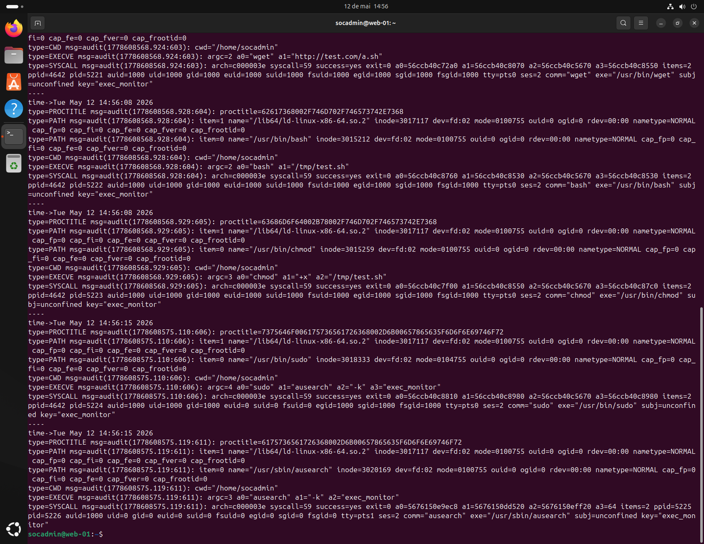
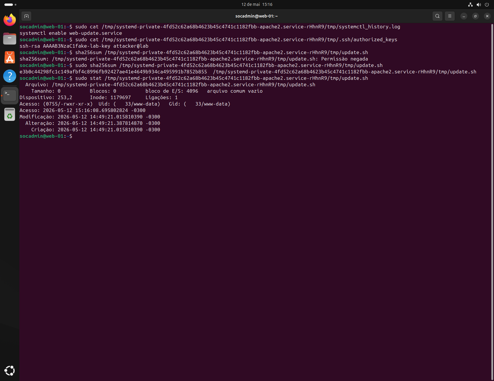
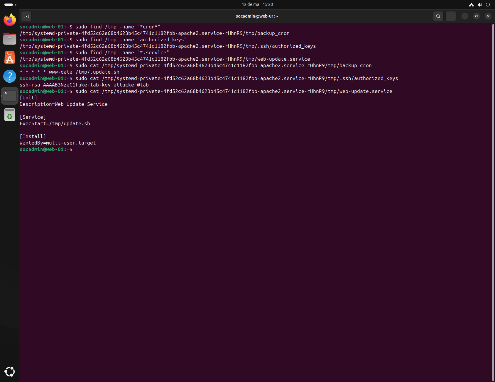
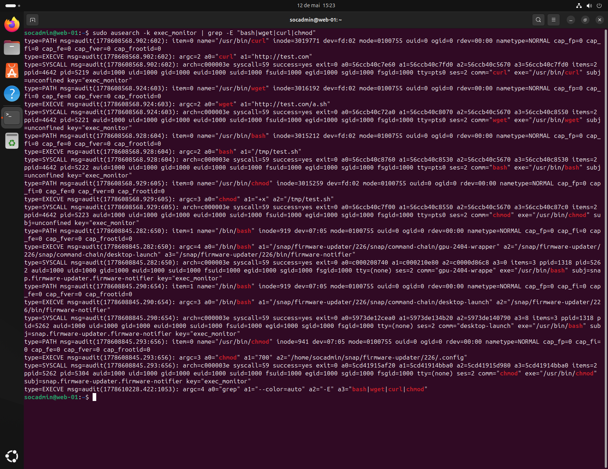

# Incident Report — Linux Persistence and Suspicious Command Execution

---

## 1. Summary

Simulation of a Linux compromise involving remote command execution, persistence establishment, suspicious command execution, and live response investigation.

- Attack vector: Web application command execution
- Technique: Command execution + persistence
- Impact: Host compromise with multiple persistence mechanisms identified

---

## 2. Timeline

| Time (UTC-3) | Event | Source |
|-------------|------|--------|
| 14:28 | Remote command execution via web application | Apache / DVWA |
| 14:39 | Reverse shell activity established | Network activity |
| 14:41 | Initial enumeration performed | Shell history |
| 14:43 | Network and process inspection executed | Process inspection |
| 14:47 | Apache log evidence reviewed | Apache logs |
| 14:51 | Threat activity simulation executed | auditd |
| 14:57 | EXECVE monitoring detected suspicious commands | auditd |
| 15:16 | Host IoCs collected | Live response |
| 15:18 | Authentication analysis completed | who / last |
| 15:21 | Persistence artifacts identified | File system |
| 15:22 | Process investigation performed | ps / pstree |
| 15:23 | Suspicious EXECVE commands validated | auditd |
| 15:26 | Wazuh detection troubleshooting performed | Wazuh |

---

# 3. Detection

**SIEM:** Wazuh + auditd

- Rule: EXECVE suspicious command monitoring
- Rule ID: Custom auditd monitoring
- Level: High

---

### Evidence



Suspicious commands identified:

- `curl`
- `wget`
- `chmod`
- `bash`

---

### Detection Gap

Wazuh alert generation was unavailable during investigation.

Detection relied primarily on:

- auditd telemetry
- manual investigation
- live response analysis

---

**Root Cause:**  
Lack of alert pipeline validation and incomplete SIEM telemetry integration.

---

### Recommendations

- Improve Wazuh alert validation
- Create correlation rules for suspicious EXECVE chains
- Monitor `/tmp` execution activity
- Implement automated response for suspicious command execution
- Improve Linux persistence detection coverage

---

# 4. Investigation

## Log Sources

- Apache access logs
- auditd EXECVE logs
- Process tree analysis
- Authentication logs
- File system artifacts

---

## Analyst Hypothesis

The attacker attempted to simulate post-exploitation activity by executing remote commands, establishing persistence, and validating outbound communication capability.

---

## Evidence



Artifacts identified:

- Cron persistence file
- Fake SSH authorized_keys
- Systemd service persistence
- Suspicious scripts under `/tmp`

---

## Execution Context

- User: `www-data`
- Privilege level: Low privileged web service context

---

## Key Findings

- ✔ Confirmed:
  - Remote command execution
  - Suspicious command execution
  - Persistence creation
  - Outbound communication attempts
  - EXECVE monitoring visibility

- ❌ Not observed:
  - Privilege escalation
  - Lateral movement
  - Data exfiltration
  - Credential dumping

---

# 5. Impact Assessment

## Severity

Severity: 8/10 (High)

---

## Scope

- Affected systems: Single Linux host
- Lateral movement: Not observed

---

## Compromise

- Initial Access: ✔
- Execution: ✔
- Privilege Level: `www-data`
- Persistence: ✔
- Data Exposure: ❌

---

## Summary

The simulated attacker achieved remote command execution through a vulnerable web application and established multiple persistence mechanisms. Suspicious command execution and outbound communication attempts were successfully identified during live response investigation.

No privilege escalation or lateral movement was observed.

---

# 6. MITRE ATT&CK Mapping

- [T1059](https://attack.mitre.org/techniques/T1059/) — Command and Scripting Interpreter
- [T1053.003](https://attack.mitre.org/techniques/T1053/003/) — Cron
- [T1098.004](https://attack.mitre.org/techniques/T1098/004/) — SSH Authorized Keys
- [T1543.002](https://attack.mitre.org/techniques/T1543/002/) — Systemd Service
- [T1071](https://attack.mitre.org/techniques/T1071/) — Application Layer Protocol

---

# 7. CIS Controls

- CIS Control 8 — Audit Log Management
- CIS Control 13 — Network Monitoring and Defense
- CIS Control 10 — Malware Defenses
- CIS Control 5 — Account Management

---

# 8. Classification

- Incident Type: Linux Host Compromise Simulation
- Severity: High

---

# 9. NIST Incident Response

- Detection: Suspicious EXECVE monitoring
- Analysis: IoC collection and process investigation
- Containment: Persistence identification and isolation
- Eradication: Artifact removal planning
- Recovery: Monitoring validation and hardening recommendations

---

# 10. ISO 27001

- A.12.4 — Logging and monitoring
- A.12.6 — Technical vulnerability management
- A.16.1 — Information security incident management

---

# 11. Response Actions

## Containment



- Persistence artifacts identified
- Suspicious activity documented
- Host investigation performed

---

## Eradication

- Cron persistence identified for removal
- SSH persistence documented
- Systemd persistence documented
- Suspicious scripts isolated

---

## Validation



Validation confirmed:

- EXECVE monitoring operational
- Suspicious commands captured
- auditd telemetry functional

---

## Outcome

The environment remained stable after investigation. Persistence artifacts and suspicious behaviors were successfully identified and documented during live response analysis.

---

# 12. Lessons Learned

- auditd provides valuable Linux visibility
- SIEM telemetry validation is critical
- Persistence hunting improves detection maturity
- Live response investigation is essential during Linux incidents
- Missing SIEM alerts can require manual investigation workflows

---

# 13. Indicators of Compromise (IoCs)

| Category | Indicator | Description | MITRE |
|----------|----------|------------|-------|
| Network | `192.168.18.226` | Attacker source IP | [T1071](https://attack.mitre.org/techniques/T1071/) |
| Host | `/tmp/update.sh` | Suspicious script | [T1059](https://attack.mitre.org/techniques/T1059/) |
| Host | `backup_cron` | Cron persistence | [T1053.003](https://attack.mitre.org/techniques/T1053/003/) |
| Host | `authorized_keys` | SSH persistence | [T1098.004](https://attack.mitre.org/techniques/T1098/004/) |
| Host | `web-update.service` | Systemd persistence | [T1543.002](https://attack.mitre.org/techniques/T1543/002/) |
| Process | `curl/wget/bash/chmod` | Suspicious command execution | [T1059](https://attack.mitre.org/techniques/T1059/) |
| Detection | EXECVE logs | auditd detection evidence | [T1059](https://attack.mitre.org/techniques/T1059/) |
| Response | Persistence investigation | Containment workflow | N/A |

---

# 14. Conclusion

Detection → Investigation → Response

This lab simulated a realistic Linux compromise scenario involving remote command execution, persistence creation, suspicious command execution, and live incident response analysis.

The investigation validated practical SOC analyst capabilities involving:

- Linux live response
- auditd investigation
- process analysis
- persistence hunting
- IoC collection
- MITRE ATT&CK mapping
- SIEM troubleshooting

The scenario demonstrated how missing SIEM telemetry can require deeper manual investigation and reinforced the importance of layered detection visibility in Linux environments.
```
